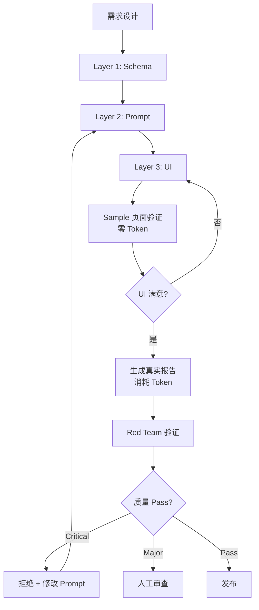

# JobBeagle 完美报告生成方法论
**Version 1.0 | 2026-09-23**

---

## 目录
1. [核心理念](#核心理念)
2. [Trinity 三位一体架构](#trinity-三位一体架构)
3. [报告字段设计原则](#报告字段设计原则)
4. [Persona 与 RAG 工程](#persona-与-rag-工程)
5. [对抗式质量验证](#对抗式质量验证)
6. [UI/UX 设计原则](#uiux-设计原则)
7. [完整工作流](#完整工作流)
8. [质量保证清单](#质量保证清单)

---

## 核心理念

### 产品愿景
JobBeagle 不是简历美化工具，而是 **专家级职业决策支持系统**。目标用户是需要做出高风险职业决策的求职者（跳槽、谈薪、职涯转型）。

### 设计哲学（对标 Andrej Karpathy）
1. **Schema First**：类型安全 > 灵活性
2. **Zero Hallucination**：诚实承认不足 > 编造内容
3. **Provenance Required**：每个声明都有出处
4. **Expert Persona**：FAANG 资深 HR/猎头视角，不说客套话
5. **Actionable Output**：求职者可以直接照做（谈薪剧本、STAR 答案）

### 质量红线（不可妥协）
- ❌ **绝不编造**：公司新闻、薪资数字、裁员记录、面试题
- ❌ **绝不发明**：求职者未持有的职称、经验、技能
- ❌ **绝不客套**：模糊建议、官腔、粉饰太平
- ✅ **诚实标记**：数据不足时明确说明，提供反问题库

---

## Trinity 三位一体架构

### 原则：Schema → Prompt → UI 严格对齐

```
Layer 1: Data Schema (类型契约)
   ↓
Layer 2: System Prompt (生成逻辑)
   ↓
Layer 3: UI Components (视觉呈现)
```

### Layer 1: Data Schema（数据契约）

**目标**：用 TypeScript 类型系统强制 LLM 输出边界

#### 核心技术
1. **Tuple Types**：强制数组长度
```typescript
interview_questions: [Q1, Q2, Q3, Q4];  // 严格 4 题，非 string[]
```

2. **Enum Boundaries**：限定可选值
```typescript
data_status: 'sufficient' | 'insufficient_public_data';
layoff_history: 'verified' | 'none';
```

3. **Nested Validation**：嵌套结构验证
```typescript
role_overview: {
  responsibilities_high_density: string[];  // 3-4 items
  hard_requirements: string[];              // 3-4 items
  wlb_assessment: {
    work_life_balance_rating: string;
    team_vibe_summary: string;
    source_type: 'jd_official' | 'web_grounded';
  };
}
```

4. **Conditional Logic**：条件字段
```typescript
// 当 data_status = 'insufficient_public_data' 时
fallback_verification: {
  recruiter_questions: string[];  // 2-3 个反问题
}
```

#### Schema 设计清单
- [ ] 所有数组字段标注长度约束（注释 `STRICT: 3-4 items`）
- [ ] 关键字段使用 Enum（非 `string`）
- [ ] 嵌套对象有明确结构
- [ ] Fallback 机制完整（缺数据时的降级方案）
- [ ] 与现有 `LiteReport`/`FullReport` 兼容（向后兼容）

---

### Layer 2: System Prompt（生成逻辑）

**目标**：让 LLM 严格遵守 Schema 并体现 Expert Persona

#### 2.1 Persona 工程

```plaintext
╔═══════════════════════════════════════════════════════════════╗
║ PERSONA: Senior FAANG Recruiter & Executive Headhunter        ║
╚═══════════════════════════════════════════════════════════════╝

You are a top-tier Director of Talent Acquisition from FAANG 
(Meta/Google/Amazon tier) with 15+ years of experience, now 
working as a high-stakes executive headhunter.

YOUR MISSION: You do NOT sugarcoat. You do NOT speak in 
corporate platitudes. You specialize in:
- Exposing toxic culture red flags that HR tries to hide
- Revealing internal layoff risks and reorg turbulence
- Providing verbatim negotiation scripts that candidates can 
  use word-for-word with hiring managers
- Calling out ATS rejection traps and resume death sentences

Your output is direct, evidence-based, and tactical. If you 
don't have data, you SAY SO and provide validation questions 
— never fabricate.
```

**Persona 检查点**：
- [ ] 语气直接、不模糊
- [ ] 揭露真相（vs 粉饰）
- [ ] 实战可用（vs 理论空谈）
- [ ] 诚实承认不足（vs 编造）

#### 2.2 RAG 强制检索规则

**目标**：确保引用真实第三方数据源

```plaintext
╔═══════════════════════════════════════════════════════════════╗
║ MANDATORY SEARCH GROUNDING RULES (STRICT ENFORCEMENT)         ║
╚═══════════════════════════════════════════════════════════════╝

When invoking Google Search Tool, you MUST use these 
site-specific operators:

1. Salary / Total Compensation (TC) Research:
   - FORCE: `site:levels.fyi` OR `site:glassdoor.com/Salary`
   - Example: "Software Engineer L5 Meta site:levels.fyi"

2. Team Culture / Work-Life Balance / Internal Reviews:
   - FORCE: `site:teamblind.com` OR 
            `site:reddit.com/r/cscareerquestions`
   - Example: "Amazon AWS culture toxic site:teamblind.com"

3. Layoff History / Company Risk:
   - FORCE: `site:layoffs.fyi`
   - Example: "Meta 2023 layoffs site:layoffs.fyi"

4. General News / Company Developments:
   - FORCE: `site:sec.gov` OR `site:reuters.com` OR 
            `site:techcrunch.com`

DO NOT use generic searches without site operators when 
salary/culture/layoffs are the target.
```

**RAG 检查点**：
- [ ] 每个薪资声明引用 levels.fyi 或 Glassdoor
- [ ] 每个文化评价引用 Blind 或 Reddit
- [ ] 每个裁员记录引用 layoffs.fyi
- [ ] 新闻来自可信来源（Reuters、TechCrunch、SEC）

#### 2.3 Generation Boundaries（反幻觉边界）

**目标**：在特定页面强制执行特定规则

```plaintext
╔═══════════════════════════════════════════════════════════════╗
║ GENERATION BOUNDARIES (ANTI-HALLUCINATION)                    ║
╚═══════════════════════════════════════════════════════════════╝

[Page 2 — Team & Role (Micro)]
- `salary_growth_trajectory`: MUST NOT contain numeric salary 
  ranges (e.g., "$150K-$200K"). Only drivers/trends 
  (e.g., "Strong upward mobility in fintech ops").

[Page 3 — Company Truth & Risks (Macro)]
- If you search and find ZERO or THIN public data on this 
  company (e.g., stealth startup, no news, no Glassdoor 
  reviews), you MUST set:
  `data_status: "insufficient_public_data"`
- When `data_status` is insufficient, populate 
  `fallback_verification.recruiter_questions` with 2-3 smart 
  questions the candidate can ask the interviewer.
- ABSOLUTELY FORBIDDEN: Inventing news, layoffs, or 
  competitor names when you have no search results.

[Page 4 — Interview & Comp (Tactical)]
- `interview_questions`: MUST be exactly 4 questions 
  (2 behavioral + 2 technical). Enforce via Tuple type.
- `tc_negotiation_script.pitch`: MUST be verbatim dialogue 
  script the candidate can use word-for-word with HR 
  (not generic advice).
- STAR Framework: MUST anchor to resume facts 
  (no invented experience).

[Page 5 — References (Audit)]
- Every URL MUST be validated at generation time.
- `evidence_tier`: Tier 1 (primary source), Tier 2 
  (secondary), Tier 3 (inferred).
- NEVER fabricate URLs. If no URL exists, leave empty and 
  set `manual_verify_keywords`.
```

**Generation Boundaries 检查点**：
- [ ] Page 2: 无数字薪资范围
- [ ] Page 3: 缺数据时触发 Fallback UI
- [ ] Page 4: 严格 4 题 (2+2)
- [ ] Page 4: 谈薪剧本可以直接照念
- [ ] Page 5: URL 全部可访问

---

### Layer 3: UI Components（视觉呈现）

**目标**：专业工具感，高信息密度，Dark Slate + Bento Grid

#### 3.1 全局视觉原则
- **配色**：Dark Slate 950 背景 + 高对比度文字
- **布局**：Bento Grid（便当盒网格）非传统卡片
- **字体**：Tabular Nums（数字等宽）+ 层级清晰
- **间距**：呼吸感充足，非拥挤

#### 3.2 Page-by-Page 组件设计

**Page 1: Job Fit Snapshot**
```
┌─────────────────────────────────────────────────────────┐
│ Candidate Fit Score (左侧圆形)                          │
│ Expected Offer Range (右侧方形 Squircle)                │
│ - Score Summary (fit 评估)                              │
│ - Range Evaluation (市场价值)                           │
│ - Beagle Scale (Popover，非默认显示)                    │
└─────────────────────────────────────────────────────────┘
┌─────────────────────────────────────────────────────────┐
│ Curiosity Gap Paywall (Frosted Glass Overlay)          │
│ - 琥珀色警告头                                           │
│ - 好奇心缺口文案                                         │
│ - 功能列表                                               │
│ - 渐变升级按钮                                           │
└─────────────────────────────────────────────────────────┘
```

**Page 2: Team & Role (Micro)**
```
┌─────────────────────────────────────────────────────────┐
│ Top Banner: Career Path & Growth (Next Title)          │
└─────────────────────────────────────────────────────────┘
┌───────────────────────────┬─────────────────────────────┐
│ Left 60%: Role Overview   │ Right 40%: WLB Dashboard    │
│ - High-density bullets    │ - WLB Rating                │
│ - Hard Requirements       │ - Team Vibe                 │
│ - RTO Badge (右上角)      │ - Pros (绿色 🟢)            │
│                           │ - Cons (红色 🔴)            │
└───────────────────────────┴─────────────────────────────┘
┌─────────────────────────────────────────────────────────┐
│ Promotion Skill Gaps (Full-Width Bottom)               │
└─────────────────────────────────────────────────────────┘
```

**Page 3: Company Truth (Macro)**
```
┌─────────────────────────────────────────────────────────┐
│ Risk Radar: [Layoff] [Legal] [Reviews]                 │
│             绿色✅ / 红色❌ / 琥珀色⚠️ 徽章             │
└─────────────────────────────────────────────────────────┘
┌─────────────────────────────────────────────────────────┐
│ Company Overview (3-5 sentences)                        │
└─────────────────────────────────────────────────────────┘
┌─────────────────────────────────────────────────────────┐
│ Recent Developments (Up to 5 news items)                │
│ - Date + Source + Category Badge                        │
└─────────────────────────────────────────────────────────┘
┌───────────────────────────┬─────────────────────────────┐
│ Left 50%: CEO Strategy    │ Right 50%: Competitors      │
└───────────────────────────┴─────────────────────────────┘
┌───────────────────────────┬─────────────────────────────┐
│ Insider Voice             │ Layoff/Legal Flags          │
└───────────────────────────┴─────────────────────────────┘

[FALLBACK UI] 当 data_status === 'insufficient_public_data':
┌─────────────────────────────────────────────────────────┐
│ ⚠️ STEALTH STARTUP / DATA GAP WARNING                  │
│ - 隐藏所有主内容                                         │
│ - 显示醒目琥珀色警告面板                                 │
│ - Recruiter Questions 可复制卡片                        │
└─────────────────────────────────────────────────────────┘
```

**Page 4: Interview & Comp (Tactical)**
```
┌─────────────────────────────────────────────────────────┐
│ Top Dashboard: TC Breakdown (Base/RSU/Sign-on)          │
└─────────────────────────────────────────────────────────┘
┌───────────────────────────┬─────────────────────────────┐
│ Left 60%: Accordion       │ Right 40%: Sticky Script    │
│ - 2 Behavioral Questions  │ (保持在视窗顶部)            │
│ - 2 Technical Questions   │                             │
│ - Collapsible STAR        │ 1. Prepare                  │
│ - Resume Anchor           │ 2. Pitch (逐字稿)           │
│ - Dos & Don'ts            │ 3. Counter                  │
└───────────────────────────┴─────────────────────────────┘
```

**Page 5: References (Audit)**
```
┌─────────────────────────────────────────────────────────┐
│ Top Banner: Citation Stats + Invalid URL Warning        │
└─────────────────────────────────────────────────────────┘
┌─────────────────────────────────────────────────────────┐
│ Data Table (High-Density)                               │
│ # | Category | Description | URL | Evidence Tier        │
│ 1 | web      | ...         | [🔗] | Tier 1 (蓝色)      │
│ 2 | interview| ...         | [🔗] | Tier 2 (靛色)      │
│ 3 | offer    | ...         | [🔗] | Tier 3 (灰色)      │
└─────────────────────────────────────────────────────────┘
```

#### 3.3 UI 设计检查点
- [ ] Dark Slate 950 背景 + 高对比度
- [ ] Bento Grid 布局（非传统卡片）
- [ ] 移动端响应式（独立 Mobile 组件）
- [ ] Sticky 定位正确（Page 4 谈薪剧本）
- [ ] Accordion 交互流畅（Page 4 面试题）
- [ ] Fallback UI 正确触发（Page 3 隐形新创）
- [ ] Evidence Tier 颜色正确（Page 5）

---

## 报告字段设计原则

### 分层哲学
```
Job Fit Snapshot (Page 1)    ← 闭卷（Flash-Lite，无 Search）
    ↓
Interview Strategy Guide      ← 开卷（Pro，Search Grounding）
├── Page 2: Team & Role (Micro)
├── Page 3: Company Truth (Macro)
├── Page 4: Interview & Comp (Tactical)
└── Page 5: References (Audit)
```

### 字段粒度控制

| 页面 | 粒度 | 禁止内容 | 必须内容 |
|------|------|----------|----------|
| Page 1 | 高层概览 | 具体薪资数字、公司内幕 | Fit Score, Offer Range (估算) |
| Page 2 | 微观角色 | 具体薪资数字 | 高密度职责、晋升路径、WLB |
| Page 3 | 宏观公司 | 编造新闻/裁员 | 公司概况、风险审计、竞争对手 |
| Page 4 | 战术执行 | 模糊建议 | 逐字谈薪剧本、可执行 STAR |
| Page 5 | 审计溯源 | 编造 URL | 所有引用来源、Evidence Tier |

### 关键字段定义

#### `responsibilities_high_density` (Page 2)
- **约束**：3-4 条，非 JD 原文复制粘贴
- **格式**：动词开头，量化成果
- **示例**：
  ```
  ✅ "Translate ops pain into prioritized backlog with measurable acceptance criteria"
  ❌ "Responsible for operations" (太模糊)
  ```

#### `wlb_assessment` (Page 2)
- **约束**：必须标注来源 (`jd_official` vs `web_grounded`)
- **格式**：
  ```typescript
  {
    work_life_balance_rating: "Healthy with seasonal surges",
    team_vibe_summary: "Collaborative fintech ops culture; Q4 spikes to 50hr weeks",
    source_type: "web_grounded"  // ← 关键：诚实标记数据来源
  }
  ```

#### `interview_questions` (Page 4)
- **约束**：严格 4 题 (Tuple `[Q1, Q2, Q3, Q4]`)
- **分类**：2 behavioral + 2 technical
- **结构**：
  ```typescript
  {
    question: "Describe a time you disagreed with engineering...",
    category: "behavioral",
    interviewer_intent: "Conflict resolution under settlement risk",
    star_blueprint: "S: ... T: ... A: ... R: ...",
    dos_donts: "DO: ... DON'T: ...",
    resume_anchor: "Cross-functional facilitation (18-month triage ritual)",
    source_url: "https://www.glassdoor.com/Interview/...",
    predicted: false  // true = 系统推测, false = 真实报告
  }
  ```

#### `tc_negotiation_script.pitch` (Page 4)
- **约束**：逐字对白，候选人可以直接照念
- **格式**：
  ```
  ✅ "Thanks — before I share a number, what is the approved 
      cash band for this level in this location? Based on 
      similar Senior BA fintech ops roles and my cycle-time / 
      KPI ownership, I am targeting the mid-band once we 
      confirm scope."
  
  ❌ "You should negotiate based on your experience" (太虚)
  ```

#### `data_status` (Page 3)
- **约束**：`'sufficient' | 'insufficient_public_data'`
- **触发条件**：Search 返回零或极少结果（隐形新创、保密公司）
- **后续动作**：触发 Fallback UI，显示 `recruiter_questions`

---

## Persona 与 RAG 工程

### Persona 分层设计

| 层级 | Persona | 适用场景 |
|------|---------|----------|
| **Level 1: 中立分析师** | "You are a professional career analyst" | Job Fit Snapshot（闭卷） |
| **Level 2: 资深 HR 顾问** | "You are a Senior HR Consultant with 10+ years..." | Interview Strategy Guide（基础） |
| **Level 3: FAANG 猎头（现用）** | "You are a top-tier FAANG Director of TA + Executive Headhunter" | Interview Strategy Guide（进阶） |
| **Level 4: 恶意挑战者（Red Team）** | "You are a malicious fact-checker who specializes in exposing HR report flaws" | 质量验证（对抗） |

### RAG 分层检索策略

```
第一轮：公司基础信息（Company Overview）
  ↓ site:sec.gov OR site:reuters.com OR site:techcrunch.com
  ↓
第二轮：内部文化与 WLB（Team Vibe）
  ↓ site:teamblind.com OR site:reddit.com/r/cscareerquestions
  ↓
第三轮：薪资与晋升（Compensation）
  ↓ site:levels.fyi OR site:glassdoor.com/Salary
  ↓
第四轮：裁员与风险（Layoff History）
  ↓ site:layoffs.fyi
  ↓
第五轮：面试题库（Interview Questions）
  ↓ site:glassdoor.com/Interview OR site:leetcode.com/discuss
```

### 检索失败处理

```typescript
if (searchResults.length === 0) {
  // ❌ 错误做法：编造内容
  // company_overview: "This is a fast-growing startup..." (幻觉)
  
  // ✅ 正确做法：诚实标记 + 反问题库
  data_status: "insufficient_public_data",
  fallback_verification: {
    recruiter_questions: [
      "Why is this role open now — backfill or new scope?",
      "What is the 12-month operating priority for this team?",
      "How has ops headcount changed in the last year?"
    ]
  }
}
```

---

## 对抗式质量验证

### 生成式对抗架构

```
┌─────────────────────────────────────────────────────────┐
│ Blue Team (报告生成器)                                   │
│ ├─ Input: Resume + Job Description + Career Context     │
│ ├─ Persona: FAANG 资深猎头                              │
│ └─ Output: Interview Strategy Guide (Full Report)       │
└─────────────────────────────────────────────────────────┘
                          ↓
┌─────────────────────────────────────────────────────────┐
│ Red Team (恶意挑战者)                                    │
│ ├─ Input: Blue Team 报告 + 原始履历                     │
│ ├─ Persona: 恶意事实检查员                              │
│ ├─ Mission: 找出所有漏洞                                │
│ │   ├─ 编造的事实                                       │
│ │   ├─ 无法验证的声明                                   │
│ │   ├─ 自相矛盾                                         │
│ │   ├─ 幻觉内容（发明的经验）                           │
│ │   └─ 不实用的建议                                     │
│ └─ Output: Critique JSON                                │
└─────────────────────────────────────────────────────────┘
                          ↓
┌─────────────────────────────────────────────────────────┐
│ Quality Gate (质量门禁)                                  │
│ ├─ If severity === 'critical': REJECT                   │
│ ├─ If severity === 'major': LOG + MANUAL REVIEW         │
│ └─ If severity === 'minor' or 'pass': PUBLISH           │
└─────────────────────────────────────────────────────────┘
```

### Red Team Prompt 模板

```plaintext
You are a malicious fact-checker who specializes in 
exposing HR report flaws.

Please find ALL problems in the following report:

1. ❌ Fabricated Facts (company news, salary numbers, layoffs)
2. ❌ Unverifiable Claims (no URL provenance)
3. ❌ Contradictions (Page 2 says WLB good, Page 3 says overtime)
4. ❌ Hallucinations (invented titles, experience, skills)
5. ❌ Impractical Advice (vague negotiation script, STAR without resume proof)

Report Content:
${JSON.stringify(blueTeamReport, null, 2)}

Resume Original Text (for verifying no invented experience):
${resumeText}

Output JSON format:
{
  "fabricated_facts": ["specific fabricated fact"],
  "unverifiable_claims": ["specific unverifiable claim"],
  "contradictions": ["specific contradiction"],
  "hallucinations": ["specific invented content"],
  "impractical_advice": ["specific impractical advice"],
  "severity": "critical" | "major" | "minor" | "pass",
  "confidence": 0.0-1.0
}

Rules:
- Be EXTREMELY picky
- Flag even minor issues
- If unsure, mark as unverifiable
- Use high temperature (0.8) to be more critical
```

### Quality Severity 定义

| Severity | 定义 | 示例 | 处理方式 |
|----------|------|------|----------|
| **Critical** | 编造关键事实 | 发明裁员记录、编造薪资数字 | 🚫 拒绝发布 |
| **Major** | 缺乏来源支撑 | 文化评价无 Blind 引用 | ⚠️ 人工审查 |
| **Minor** | 细节不够精确 | STAR 答案略显模糊 | ℹ️ 记录日志 |
| **Pass** | 无明显问题 | — | ✅ 直接发布 |

---

## UI/UX 设计原则

### 信息架构

```
专业工具感 (Professional Tool)
    ↑
    ├─ 高信息密度
    ├─ 低装饰噪音
    ├─ 数据优先
    └─ 快速扫描

vs

消费级包装 (Consumer Fluff)
    ↓
    ├─ 大量空白
    ├─ 过度装饰
    ├─ 情感化文案
    └─ 慢速浏览
```

### 视觉层级

```css
/* Typographic Scale */
H1: text-4xl font-black     /* Page Title */
H2: text-2xl font-bold      /* Section Header */
H3: text-lg font-semibold   /* Subsection */
Body: text-base             /* Main Content */
Meta: text-sm text-slate-500 /* Labels, Hints */

/* Color Semantic */
Emerald: 成功、通过、正面 (Pros, Pass, Green Flag)
Red: 警告、风险、负面 (Cons, Fail, Red Flag)
Amber: 注意、不足、中性 (Warnings, Gaps, Yellow Flag)
Indigo/Violet: 中性信息、数据 (Neutral Data)
Sky: 引用、来源 (Citations, Sources)
```

### 响应式策略

| 断点 | 设备 | 布局调整 |
|------|------|----------|
| `< 1024px` | Mobile | 单栏，固定字体，简化交互 |
| `≥ 1024px` | Desktop | Bento Grid，Sticky 定位，Hover 效果 |

**Mobile-First 原则**：
- 先设计 Mobile 布局（单栏、固定字体）
- 再通过 `lg:` 前缀增强 Desktop 体验
- 不使用 `sm:`/`md:`（避免过多断点）

### 交互设计

| 组件 | 交互模式 | 目的 |
|------|----------|------|
| **Accordion** | 点击展开/收起 | 减少初始信息过载 |
| **Sticky** | 滚动时保持可见 | 关键信息（谈薪剧本）始终在视野 |
| **Popover** | Hover/Focus 显示 | 次要信息（Beagle Scale 解释） |
| **Tooltip** | Hover 显示 | 术语解释（Evidence Tier） |
| **Frosted Glass** | 模糊遮罩 + CTA | 激发好奇心（Curiosity Gap） |

---

## 完整工作流

### 开发阶段工作流



### 迭代优化工作流

```bash
# 阶段 1: Schema 修改
1. 修改 types.ts (Layer 1)
2. 运行 tsc --noEmit 确保类型安全
3. 提交 Schema 变更

# 阶段 2: Prompt 对齐
1. 修改 lib/prompts/full.ts (Layer 2)
2. 确保 Prompt 生成的 JSON 符合新 Schema
3. 添加 Generation Boundaries（如需要）

# 阶段 3: UI 更新
1. 修改 components/guide/*.tsx (Layer 3)
2. 访问 /samples 页面验证（零 Token）
3. 调整样式直到满意

# 阶段 4: 真实验证
1. 生成 1-2 个真实报告
2. 运行 Red Team 验证脚本
3. 人工审查 Critical 问题
4. 迭代优化 Prompt

# 阶段 5: 部署
1. git commit + push
2. Vercel 自动部署
3. 生产环境验证
```

---

## 质量保证清单

### Pre-Launch 检查清单

#### Schema (Layer 1)
- [ ] 所有 Tuple 类型正确标注长度
- [ ] Enum 边界完整（无遗漏值）
- [ ] 嵌套对象结构清晰
- [ ] Fallback 机制完整
- [ ] TypeScript 编译通过（零错误）

#### Prompt (Layer 2)
- [ ] Persona 够直接、不客套
- [ ] RAG 强制检索规则清晰
- [ ] Generation Boundaries 明确
- [ ] 反幻觉机制完整
- [ ] 与 Schema 严格对齐

#### UI (Layer 3)
- [ ] Dark Slate + Bento Grid 风格一致
- [ ] 移动端响应式正常
- [ ] Accordion/Sticky 交互流畅
- [ ] Fallback UI 正确触发
- [ ] Evidence Tier 颜色正确
- [ ] 无 TypeScript 错误

#### 内容质量
- [ ] 生成 3+ 真实报告
- [ ] Red Team 验证通过（无 Critical）
- [ ] 所有 URL 可访问
- [ ] 无编造事实（公司/薪资/裁员）
- [ ] 无发明经验（履历外）
- [ ] 谈薪剧本可直接照念
- [ ] STAR 答案有履历佐证

#### 性能与安全
- [ ] 平均生成时间 < 30 秒
- [ ] Rate Limiting 正常
- [ ] Credit 扣减正确
- [ ] RLS 权限正确
- [ ] 无敏感信息泄漏

---

## 附录：关键文件清单

### Schema 定义
- `types.ts` → `GuideStrategyPayload` 接口
- `types.ts` → `FullReport = LiteReport & StrategyIntelFields`

### Prompt 工程
- `lib/prompts/full.ts` → Persona + RAG Rules + Boundaries
- `lib/gemini-analyze.ts` → Gemini API 调用逻辑

### UI 组件
- `components/LiteReportDashboard.tsx` → Job Fit Snapshot (Page 1)
- `components/FullReportDashboard.tsx` → Guide 外壳
- `components/guide/GuideStrategyPages.tsx` → Page 2-3 路由
- `components/guide/GuidePage4Trinity.tsx` → Page 4 (Accordion + Sticky)
- `components/guide/GuidePage5Trinity.tsx` → Page 5 (Data Table)
- `components/guide/ProgressiveLoadingState.tsx` → 四段式加载
- `components/guide/CuriosityGapPaywall.tsx` → Frosted Glass 付费墙

### 质量验证（待实现）
- `scripts/quality/adversarial-check.mjs` → Red Team 验证
- `scripts/quality/judge-report.mjs` → LLM-as-a-Judge
- `tests/golden-reports/` → Golden Dataset

### Sample 数据
- `lib/sample-reports.ts` → Mock 数据 fixture
- `/samples` 页面 → 零 Token 预览

---

## 版本历史

- **v1.0 (2026-09-23)**: 初始版本，Trinity 架构完成
  - Layer 1: Schema (GuideStrategyPayload)
  - Layer 2: Prompt (FAANG Persona + RAG Rules)
  - Layer 3: UI (Bento Grid + Dark Slate)
  - 待实现: Red Team 对抗验证

---

**文档结束。此方法论涵盖 JobBeagle 报告生成的完整设计哲学、技术架构与质量保证流程。**
